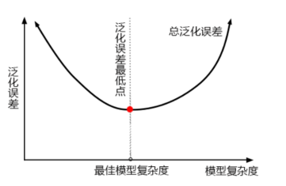
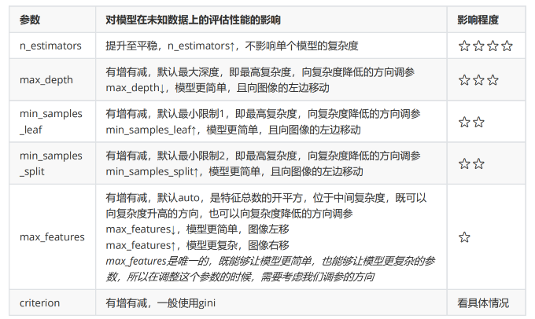
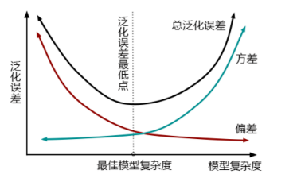

# Sklearn

# #0 评估指标

## 1）分类

- AUC

# 2)连续

# #1决策树

- 不纯度
  - 指标
    - Gini Impurity&#x20;
    - Entropy（欠拟合的时候用； 慢一点，含对数计算）&#x20;

# #2 RF

- Bagging: 并行

> 对基评估器的预测结果进行平均或用多数表决，原则来决定集成评估器的结果

## 1）RandomForestClassifier

- Parameter
  - random\_state：随机生产一个固定的森林
  - bootstrap：有放回随机抽样

    随机采样，每次采样一个样本，并在抽取下一个样本之前将该样本放回原始训练集，也就是说下次采样时这个样本依然可能被采集到，这样采集n次，最终得到一个和原始训练集一样大的，n个样本组成的自助集。

    评价：
    - pro：令基分类器尽量都不一样
    - con：浪费训练数据
  - oob\_score：out of bag data

    可以不划分测试集和训练集，只需要用袋外数据来测试我们的模型即可。
    ```python
    #无需划分训练集和测试集
    rfc = RandomForestClassifier(n_estimators=25,oob_score=True)
    rfc = rfc.fit(wine.data,wine.target)
    #重要属性oob_score_
    rfc.oob_score_
    ```

  - 重要属性和接口
    ```python
    # Per
    .estimators_  
    .oob_score_ 
    .feature_importances_

    # API
    apply, fit, predict和score
    predict_proba # sk-learnAPI：返回每个测试样本对应的被分到每一类标签的概率

    ```

  ## 2）RandomForestRegressor
  - 回归树的接口score返回的是R平方，并不是MSE。
  - 是sklearn当中使用均方误差作为评判标准时，却是计算”负均方误差“（neg\_mean\_squared\_error）
  ```python
  from sklearn.datasets import load_boston
  from sklearn.model_selection import cross_val_score
  from sklearn.ensemble import RandomForestRegressor
  boston = load_boston()
  regressor = RandomForestRegressor(n_estimators=100,random_state=0)
  cross_val_score(regressor, boston.data, boston.target, cv=10
                 ,scoring = "neg_mean_squared_error")
  sorted(sklearn.metrics.SCORERS.keys())
  ```

  - SimpleImputer：随机森林回归填补缺失值
  ```python
  from sklearn.impute import SimpleImputer

  #使用均值进行填补
  imp_mean = SimpleImputer(missing_values=np.nan, strategy='mean')
  X_missing_mean = imp_mean.fit_transform(X_missing)

  #使用0进行填补
  imp_0 = SimpleImputer(missing_values=np.nan, strategy="constant",fill_value=0)
  X_missing_0 = imp_0.fit_transform(X_missing)

  ```

  ## 3）机器学习中调参的基本思想
  - 模型在未知数据上的准确率受什么因素影响
    - 泛化误差（方差偏差困境）：
    > 当模型太复杂，模型就会过拟合，泛化能力就不够，所以泛化误差大。当模型太简单，模型就会欠拟合，拟合能力就不够，所以误差也会大。只有当模型的复杂度刚刚好的才能够达到泛化误差最小的目标。
    
  * RF参数对复杂度影响

    
  * 原理
    - 一个集成模型(f)在未知数据集(D)上的泛化误差E(f;D)，由方差(var)，偏差(bais)和噪声(ε)共同决定。
      - 偏差：模型的预测值与真实值之间的差异。偏差衡量模型是否预测得准确，偏差越小，模型越“准”
      - 方差：反映的是模型每一次输出结果与模型预测值的平均水平之间的误差。方差衡量模型每次预测的结果是否接近，即是说方差越小，模型越“稳”
    - 复杂度
      - 复杂度高：预测准(偏差小），模型在一部分数据上表现很好，在另一部分数据上表现却很糟糕。模型泛化性差，在不同数据上表现不稳定，所以方差就大。
      - 复杂度低：模型稳(方差小，泛化能力强），不需要对数据进行一个太深的学习，只需要建立一个比较简单，判定比较宽泛的模型就可以了。模型无法在某一类或者某一组数据上达成很高的准确度，所以偏差就会大。
        
    - 结论：

      对复杂度大的模型，要降低方差，对相对简单的模型，要降低偏差。
  ## 4）乳腺癌数据
  ```python
  from sklearn.datasets import load_breast_cancer
  from sklearn.ensemble import RandomForestClassifier
  from sklearn.model_selection import GridSearchCV
  from sklearn.model_selection import cross_val_score
  import matplotlib.pyplot as plt
  import pandas as pd
  import numpy as np
  data = load_breast_cancer()

  rfc = RandomForestClassifier(n_estimators=100,random_state=90)
  score_pre = cross_val_score(rfc,data.data,data.target,cv=10,scoring='accuracy').mean()
  score_pre


  ```

  1.学习曲线：返回n\_estimators最优值
  ```python
  #####【TIME WARNING: 30 seconds】#####
  #粗调
  scorel = []
  for i in range(0,200,10):
      rfc = RandomForestClassifier(n_estimators=i+1, #从1开始计算
                                   n_jobs=-1,
                                   random_state=90)
      score = cross_val_score(rfc,data.data,data.target,cv=10).mean()
      scorel.append(score)
      
  print(max(scorel),(scorel.index(max(scorel))*10)+1) #返回最优参数
  plt.figure(figsize=[20,5])
  plt.plot(range(1,201,10),scorel)
  plt.show()

  #精调
  scorel = []
  for i in range(35,45):
      rfc = RandomForestClassifier(n_estimators=i,
                                   n_jobs=-1,
                                   random_state=90)
      score = cross_val_score(rfc,data.data,data.target,cv=10).mean()
      scorel.append(score)
  print(max(scorel),([*range(35,45)][scorel.index(max(scorel))]))
  plt.figure(figsize=[20,5])
  plt.plot(range(35,45),scorel)
  plt.show()

  ```

  2.网格搜索：逐个参数放入,观测参数对模型准确度影响
  ```python
  #限制max_depth，让模型变简单
  param_grid = {'max_depth':np.arange(1, 20, 1)}
  # 一般根据数据的大小来进行一个试探，乳腺癌数据很小，所以可以采用1~10，或者1~20这样的试探
  # 但对于像digit recognition那样的大型数据来说，我们应该尝试30~50层深度（或许还不足够
  #   更应该画出学习曲线，来观察深度对模型的影响
  rfc = RandomForestClassifier(n_estimators=39
                               ,random_state=90
                             )
  GS = GridSearchCV(rfc,param_grid,cv=10)
  GS.fit(data.data,data.target)
  GS.best_params_
  GS.best_score_ #降如果下降，说明模型处于最优复杂点左边，复杂度需要增加
  # 可以考虑增加max_featrues，默认最小值是sqrt(n_features)


  ```

  max\_features&#x20;
  ```python
  #调整max_features
  param_grid = {'max_features':np.arange(5,30,1)} 
  """
  max_features是唯一一个即能够将模型往左（低方差高偏差）推，也能够将模型往右（高方差低偏差）推的参数。我
  们需要根据调参前，模型所在的位置（在泛化误差最低点的左边还是右边）来决定我们要将max_features往哪边调。
  现在模型位于图像左侧，我们需要的是更高的复杂度，因此我们应该把max_features往更大的方向调整，可用的特征
  越多，模型才会越复杂。max_features的默认最小值是sqrt(n_features)，因此我们使用这个值作为调参范围的
  最小值。
  """
  rfc = RandomForestClassifier(n_estimators=39
                               ,random_state=90
                             )
  GS = GridSearchCV(rfc,param_grid,cv=10)
  GS.fit(data.data,data.target)
  GS.best_params_
  GS.best_score_ #增加复杂度后，如果下降，说明模型达到预测上线
  ```

  调整min\_samples\_leaf
  ```python
  #调整min_samples_leaf
  param_grid={'min_samples_leaf':np.arange(1, 1+10, 1)}
  #对于min_samples_split和min_samples_leaf,一般是从他们的最小值开始向上增加10或20
  #面对高维度高样本量数据，如果不放心，也可以直接+50，对于大型数据，可能需要200~300的范围
  #如果调整的时候发现准确率无论如何都上不来，那可以放心大胆调一个很大的数据，大力限制模型的复杂度
  rfc = RandomForestClassifier(n_estimators=39
                               ,random_state=90
                             )
  GS = GridSearchCV(rfc,param_grid,cv=10)
  GS.fit(data.data,data.target)
  GS.best_params_
  GS.best_score_
  # 网格搜索返回了min_samples_leaf的最小值，并且模型整体的准确率还降低了，这和max_depth的情
  # 况一致，参数把模型向左推，但是模型的泛化误差上升了
  ```

  min\_samples\_split
  ```python
  #调整min_samples_split
  param_grid={'min_samples_split':np.arange(2, 2+20, 1)}
  rfc = RandomForestClassifier(n_estimators=39
                               ,random_state=90
                             )
  GS = GridSearchCV(rfc,param_grid,cv=10)
  GS.fit(data.data,data.target)
  GS.best_params_
  GS.best_score_
  # 返回最小值并且模型整体的准确率降低了
  # 无用
  ```

  criterion
  ```python
  #调整Criterion
  param_grid = {'criterion':['gini', 'entropy']}
  rfc = RandomForestClassifier(n_estimators=39
                               ,random_state=90
                             )
  GS = GridSearchCV(rfc,param_grid,cv=10)
  GS.fit(data.data,data.target)
  GS.best_params_
  GS.best_score_
  ```

  调整完毕，总结出模型的最佳参数
  ```python
  rfc = RandomForestClassifier(n_estimators=39,random_state=90)
  score = cross_val_score(rfc,data.data,data.target,cv=10).mean()
  score
  score - score_pre # 调参结果
  ```
